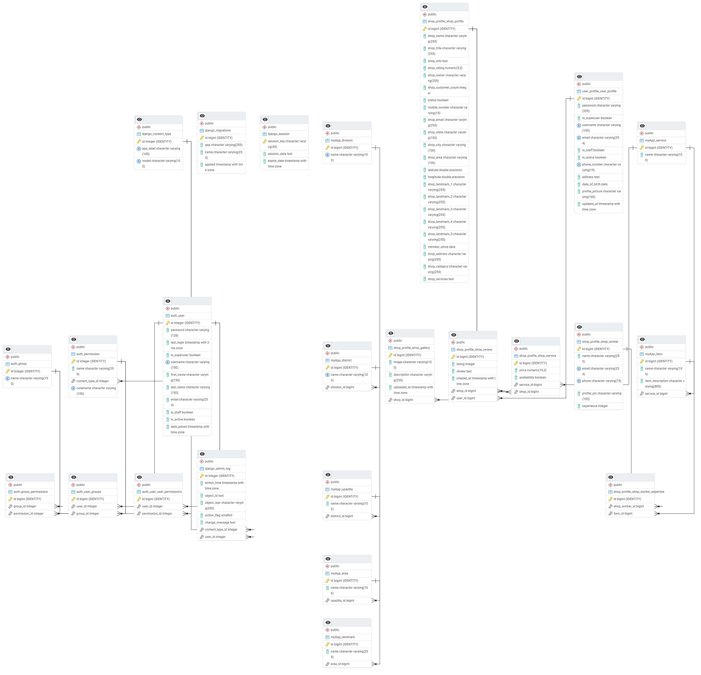

# quantum-trio
https://sonarcloud.io/api/project_badges/measure?project=Learnathon-By-Geeky-Solutions_quantum-trio&metric=alert_status
## Team Members
- IsratJahanR (Team Leader)
- rakib151p
- asfak27

## Mentor
- rajeshsaha-bs23

## Project Description
CareHub:
Motivation behind the project
----------------------------------------
Our project, CareHub, addresses the prevalent issues faced by people in Bangladesh when accessing beauty and wellness services. Long wait times, uncertainty about service availability, or difficulty in finding reliable providers in a new city are common frustrations. Time is a precious resource, and CareHub aims to honor that with a solution designed for both men and women.

Imagine a job holder with a demanding 9-to-5 schedule. After a long day, they barely have time to unwind, let alone spend hours waiting for a grooming session. For them, every minute counts. Now consider a student juggling classes, assignments, and social commitments—planning even a simple outing can feel overwhelming.

Or picture another scenario: you suddenly learn about an important meeting or have a wedding or a major event coming up. You need to look your best, but time is not on your side. Whether it’s a quick touch-up, a complete makeover, or a specialized beauty treatment, the urgency adds to the stress.

CareHub is designed to address these real-life challenges for everyone. Our platform goes beyond salon services, offering a comprehensive range of beauty and wellness solutions tailored to your needs. Whether it’s hairstyling, skincare, makeup, or even home services for special occasions, CareHub provides access to the best service providers.

With real-time availability, customizable booking slots, and the convenience of home services, CareHub ensures you can manage your beauty and wellness needs effortlessly. It’s about saving time, reducing stress, and making top-quality services accessible to everyone—because beauty and confidence should be for all.

Project-Overview
----------------
CareHub BD is a comprehensive platform designed to solve the common
challenges faced by salon and parlour customers in Bangladesh. It allows users to easily find, book,
and manage salon and parlour services with customizable options. By providing advanced search
and filtering, real-time booking management, expert selection, and communication
tools, CareHub BD ensures a seamless experience for both customers and shop
owners. The platform's focus on convenience, transparency, and user satisfaction
makes it a transformative solution for the salon industry.

Features
--------
1. User Authentication: Separate login/signup for customers and shop profiles.
2. Customer Profile: Manage personal details, bookings, and preferences.
3. Shop Profile: Maintain shop information, services, and worker details.
4. Advanced Filtering: Search based on services, ratings, reviews, and location.
5. Ratings and Reviews: Discover the best salons/parlour based on customer feedback.
6. Advanced Booking: Book appointments in advance with customizable date and time slots.
7. Service Provider Selection: Choose your preferred expert for each of your desired service.
8. Payment Slip: Auto-generation of payment slips for confirmation.
9. In-App Chat: Direct communication with shop manager for queries or service details.
0. Booking Reports: Detailed booking reports for both shop owners and customers.
11. Order Confirmation: Dual consent system for both customer and shop owner that means a order will show completed only if both customer and shop owner/expert consent that the order have been completed.
12. Post-Service Ratings: Rate your barber or expert after the service. Only when the order became completed, you can rate the shop or the expert to prevent fraud or fake rating. 
13. Shop Dashboard: Manage shop information, services, bookings and workers.
14. Notifications: Instant notification for every new booking also there will have a reminder for upcoming order.
15. Admin Management: Comprehensive admin panel for system control and management.

## Initial Entity Relationship Diagram(ER)

## Development Guidelines
1. Create feature branches
2. Make small, focused commits
3. Write descriptive commit messages
4. Create pull requests for review

## Resources
- [Project Documentation](docs/)
- [Development Setup](docs/setup.md)
- [Contributing Guidelines](CONTRIBUTING.md)
